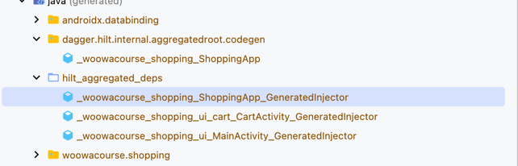
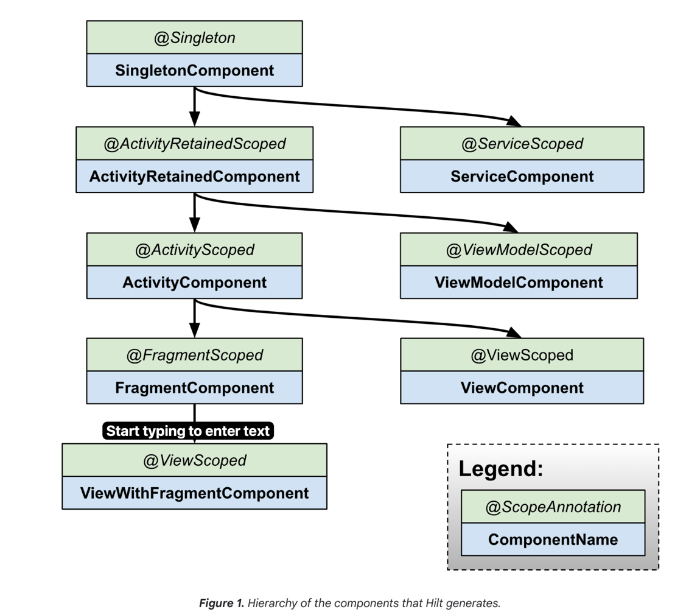
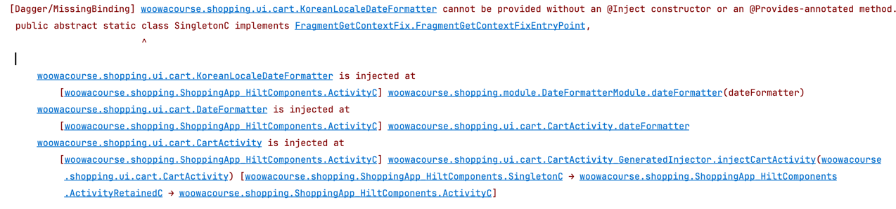

# Hilt

## HiltAndroidApp

> @HiltAndroidApp triggers Hilt's code generation,
> including a base class for your application that serves as the application-level dependency container.
>
>
> This generated Hilt component is attached to the Application object's lifecycle and provides dependencies to it.
> Additionally, it is the parent component of the app, which means that other components can access the dependencies
> that it provides.

@HiltAndroidApp 어노테이션은 Hilt의 코드 생성을 트리거하며, 애플리케이션 수준의 의존성 컨테이너로 사용되는 애플리케이션의 기본 클래스를 생성합니다.
이렇게 생성된 힐트 컴포넌트들은 애플리케이션 객체의 라이프사이클에 연결되어 의존성을 제공하며, 앱의 부모 컴포넌트이기 때문에 다른 컴포넌트들이 제공하는 의존성에 접근할 수 있습니다.

## AndroidEntryPoint

> Once Hilt is set up in your Application class and an application-level component is available,
> Hilt can provide dependencies to other Android classes that have the @AndroidEntryPoint annotation:

힐트가 애플리케이션 클래스에 설정되고 애플리케이션 수준의 컴포넌트가 사용 가능한 경우, 힐트는 @AndroidEntryPoint 어노테이션이 있는 다른 Android 클래스에 의존성을 제공할 수 있습니다.

현재 힐트가 지원하는 Android 클래스는 다음과 같습니다.

* Application (by using @HiltAndroidApp)
* ViewModel (by using @HiltViewModel)
* Activity
* Fragment
* View
* Service
* BroadcastReceiver

kapt 가 이런 식으로 Injector 클래스를 만들어주는 구만요


> If you annotate an Android class with @AndroidEntryPoint, then you also must annotate Android classes that depend on
> it.  
> For example, if you annotate a fragment, then you must also annotate any activities where you use that fragment.

@AndroidEntryPoint 어노테이션을 사용하여 Android 클래스에 어노테이션을 달면, 해당 클래스에 의존하는 Android 클래스에도 어노테이션을 달아야 합니다.
예:

* 액티비티에 어노테이션을 달면, Application 에 @HiltAndroidApp 어노테이션을 달아야 합니다. 안 그러면
  터짐. `(Hilt Activity must be attached to an @HiltAndroidApp Application)`
* 프래그먼트에 어노테이션을 달면 해당 프래그먼트를 사용하는 모든 액티비티에도 어노테이션을 달아야 합니다.

> Note: The following exceptions apply to Hilt support for Android classes:
> Hilt only supports activities that extend ComponentActivity, such as AppCompatActivity.
> Hilt only supports fragments that extend androidx.Fragment.
> Hilt does not support retained fragments.

힐트는 오직
ComponentActivity를 상속받은 액티비티만 지원합니다.
androidx.Fragment를 상속받은 프래그먼트만 지원합니다.
retained fragments는 지원하지 않습니다.

> @AndroidEntryPoint generates an individual Hilt component for each Android class in your project. These components can
> receive dependencies from their respective parent classes as described in Component hierarchy.

@AndroidEntryPoint는 프로젝트의 각 Android 클래스에 대해 개별 Hilt 컴포넌트를 생성합니다. 이러한 컴포넌트들은 컴포넌트 계층 구조에 설명된대로 해당 부모 클래스로부터 의존성을 받을 수
있습니다.



To obtain dependencies from a component, use the @Inject annotation to perform field injection:

컴포넌트에서 의존성을 얻으려면 @Inject 어노테이션을 사용하여 필드 주입을 수행하십시오.

```kotlin
@AndroidEntryPoint
class ExampleActivity : AppCompatActivity() {

    @Inject
    lateinit var analytics: AnalyticsAdapter
    ...
}
```

## Define Hilt Binding

> To perform field injection, Hilt needs to know how to provide instances of the necessary dependencies from the
> corresponding component.
> A binding contains the information necessary to provide instances of a type as a dependency.

필드 주입을 수행하려면 Hilt가 해당 컴포넌트에서 필요한 의존성의 인스턴스를 제공하는 방법을 알아야 합니다. 바인딩에는 종속성으로서의 유형의 인스턴스를 제공하는 데 필요한 정보가 포함되어 있습니다.

> One way to provide binding information to Hilt is constructor injection.
> Use the @Inject annotation on the constructor of a class to tell Hilt how to provide instances of that class:

Hilt에 바인딩 정보를 제공하는 한 가지 방법은 생성자 주입입니다. 클래스의 생성자에 @Inject 어노테이션을 사용하여 Hilt에 해당 클래스의 인스턴스를 제공하는 방법을 알려줍니다.

```kotlin
class AnalyticsAdapter @Inject constructor(
    private val service: AnalyticsService
) { ... }
```

> The parameters of an annotated constructor of a class are the dependencies of that class.
> In the example, AnalyticsAdapter has AnalyticsService as a dependency.
> Therefore, Hilt must also know how to provide instances of AnalyticsService.

클래스의 애노테이션된 생성자의 파라미터는 클래스의 의존성입니다.
예를 들어, AnalyticsAdapter는 AnalyticsService를 의존성으로 가지고 있습니다.
따라서 Hilt는 AnalyticsService의 인스턴스를 제공하는 방법도 알아야 합니다.

> Note: At build time, Hilt generates Dagger components for Android classes. Then, Dagger walks through your code and
> performs the following steps:
> Builds and validates dependency graphs, ensuring that there are no unsatisfied dependencies and no dependency cycles.
> Generates the classes that it uses at runtime to create the actual objects and their dependencies.

빌드 시점에 힐트는 Android 클래스에 대한 Dagger 컴포넌트를 생성합니다. 그런 다음 Dagger는 코드를 통해 다음 단계를 수행합니다.

* 의존성 그래프를 빌드하고 유효성을 검사하여 미해결된 의존성이 없고 의존성 순환이 없는지 확인합니다.
* 실제 객체 및 해당 의존성을 생성하는 데 런타임에서 사용하는 클래스를 생성합니다.

inject 해야 한다고 해놓고, inject 안하면 런타임 에러가 나는구만요

```
/Users/simjihun/wooteco/level4/android-di/app/build/generated/hilt/component_sources/debug/woowacourse/shopping/ShoppingApp_HiltComponents.java:136: error: [Dagger/MissingBinding] woowacourse.shopping.ui.cart.IDateFormatter cannot be provided without an @Provides-annotated method.
```

CartActivity 에서 사용하는 IDateFormatter 프로퍼티에 대해 @Inject 한다고 해두었는데, 실제로 주입하고 있는 곳이 없어서 런타임 에러가 발생했습니다.

## Hilt Modules

> Sometimes a type cannot be constructor-injected. This can happen for multiple reasons.
> For example, you cannot constructor-inject an interface.
> You also cannot constructor-inject a type that you do not own, such as a class from an external library.
> In these cases, you can provide Hilt with binding information by using Hilt modules.

어떤 타입은 생성자 주입될 수 없습니다. 이는 여러 가지 이유로 발생할 수 있습니다.
예를 들어, 인터페이스를 생성자 주입할 수 없습니다. 또한 외부 라이브러리의 클래스와 같이 소유하지 않은 타입을 생성자 주입할 수 없습니다.
이러한 경우에는 Hilt 모듈을 사용하여 Hilt에 바인딩 정보를 제공할 수 있습니다.

> A Hilt module is a class that is annotated with @Module.
> Like a Dagger module, it informs Hilt how to provide instances of certain types.
> Unlike Dagger modules, you must annotate Hilt modules with @InstallIn to tell Hilt which Android class each module
> will be used or installed in.

힐트 모듈은 @Module로 주석이 달린 클래스입니다. Dagger 모듈과 같이 특정 타입의 인스턴스를 제공하는 방법을 Hilt에 알려줍니다.
대거 모듈과 달리, Hilt 모듈을 사용하려면 @InstallIn으로 주석을 달아야 하며, 각 모듈이 사용되거나 설치될 Android 클래스를 Hilt에 알려야 합니다.

> Dependencies that you provide in Hilt modules are available in all generated components that are associated with the
> Android class where you install the Hilt module.

힐트 모듈에서 제공하는 의존성은 Hilt 모듈을 설치하는 Android 클래스와 관련된 모든 생성된 컴포넌트에서 사용할 수 있습니다.

> Note: Because Hilt's code generation needs access to all of the Gradle modules that use Hilt, the Gradle module that
> compiles your Application class also needs to have all of your Hilt modules and constructor-injected classes in its
> transitive dependencies.

힐트의 코드 생성이 Hilt를 사용하는 모든 Gradle 모듈에 액세스해야 하기 때문에, 애플리케이션 클래스를 컴파일하는 Gradle 모듈에도 힐트 모듈과 생성자 주입된 클래스가 모두 트랜지티브(recursive)
의존성으로 포함되어 있어야 합니다.

### Inject interface instances with @Binds

> Consider the AnalyticsService example. If AnalyticsService is an interface, then you cannot constructor-inject it.
> Instead, provide Hilt with the binding information by creating an abstract function annotated with @Binds inside a
> Hilt module.

AnalyticsService 예제, 만약 AnalyticsService 가 인터페이스이면, 생성자 주입이 안 됩니다.
대신에 힐트에게 바인딩 정보를 제공하기 위해 Hilt 모듈 내부에 @Binds로 주석이 달린 추상 함수를 생성합니다.

> The @Binds annotation tells Hilt which implementation to use when it needs to provide an instance of an interface.

@Binds 애노테이션은 힐트에게 인터페이스의 인스턴스를 제공할 때 어떤 구현을 사용해야 하는지 알려줍니다.

> The annotated function provides the following information to Hilt:
> The function return type tells Hilt what interface the function provides instances of.
> The function parameter tells Hilt which implementation to provide.

주석이 달린 함수는 Hilt에 다음 정보를 제공합니다.

* 함수 리턴 타입은 함수가 인스턴스를 제공하는 인터페이스를 Hilt에 알려줍니다.
* 함수 파라미터는 Hilt에게 어떤 구현체을 제공해야 하는지 알려줍니다.

```kotlin
interface AnalyticsService {
    fun analyticsMethods()
}

// Constructor-injected, because Hilt needs to know how to
// provide instances of AnalyticsServiceImpl, too.
class AnalyticsServiceImpl @Inject constructor(
    ...
) : AnalyticsService { ... }

@Module
@InstallIn(ActivityComponent::class)
abstract class AnalyticsModule {

    @Binds
    abstract fun bindAnalyticsService(
        analyticsServiceImpl: AnalyticsServiceImpl
    ): AnalyticsService
}
```

> The Hilt module AnalyticsModule is annotated with @InstallIn(ActivityComponent.class) because you want Hilt to inject
> that dependency into ExampleActivity.
> This annotation means that all of the dependencies in AnalyticsModule are available in all of the app's activities.

힐트 모듈 AnalyticsModule @InstallIn(ActivityComponent.class)로 주석이 달려 있습니다. 왜냐하면 ExampleActivity에 의존성을 주입하려고 하기 때문입니다.
이 주석은 AnalyticsModule의 모든 의존성이 앱의 모든 액티비티에서 사용할 수 있음을 의미합니다.

```kotlin
class KoreanLocaleDateFormatter @Inject constructor(context: Context) : DateFormatter {
    // ...
}

interface DateFormatter { /*...*/ }

@AndroidEntryPoint
class CartActivity : AppCompatActivity() {
    // ...
    @Inject
    lateinit var dateFormatter: DateFormatter
}

@Module
@InstallIn(ActivityComponent::class)
abstract class DateFormatterModule {
    @Binds
    abstract fun dateFormatter(
        dateFormatter: KoreanLocaleDateFormatter
    ): DateFormatter
}

```

왜 터지지?

KoreanLocaleDateFormatter의 생성자 주입 미설정:

* KoreanLocaleDateFormatter는 Context를 생성자 인자로 받습니다.
  Hilt가 Context를 제공하기 위해서는 적절한 컴포넌트 범위에서 의존성을 해결해야 합니다.

```kotlin
@HiltViewModel
class MainViewModel @Inject constructor(
    @Inject
    var productRepository: InMemoryProductRepository,
    @Inject
    var cartRepository: InMemoryCartRepository
) : ViewModel() { /*...*/ }

@AndroidEntryPoint
class MainActivity : AppCompatActivity() {
    private val viewModel by lazy {
        ViewModelProvider(this)[MainViewModel::class.java]
    }
    /*...*/
}
```

이렇게 해도 터지는 구나
근데 에러 메시지가
> Dagger does not support injection into private fields
> private woowacourse.shopping.data.InMemoryProductRepository productRepository;
> 이렇게 뜨네

@Singleton 을 어디에 선언해야 할까?
Module VS 구현체

* Module

```kotlin
@Module
@InstallIn(SingletonComponent::class)
abstract class RepositoryModule {

    @Binds
    @Singleton
    abstract fun productRepository(
        productRepository: InMemoryProductRepository
    ): ProductRepository
}

class InMemoryProductRepository @Inject constructor() : ProductRepository {
    /*...*/
}
```

* 구현체

```kotlin
@Module
@InstallIn(SingletonComponent::class)
abstract class RepositoryModule {

    @Binds
    abstract fun productRepository(
        productRepository: InMemoryProductRepository
    ): ProductRepository
}

@Singleton
class InMemoryProductRepository @Inject constructor() : ProductRepository {
    /*...*/
}
```